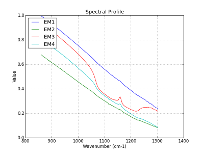

Warm hematite drill core
++++++++++++++++++++++++

A new version of the hematite example is introduced for the 0.12.0 version. The main improvement is to use FCLS instead of NNLS. With the introduction of FCLS a higher precision is obtained and only four endmembers is needed to map the quartz and, this is new, to define the mask. You can consult the version 0.11.0 for the previous analysis.

Quartz and feldspar have absorption feature in the LWIR range. Hematite (Fe2O3) has no absorption feature in the sensor spectral range. The dark regions correspond to a quartz (SiO2) impurity in the sample (figure 1). The broad spectral feature between 1050 and 1275 cm-1 is associated with the Si-O asymmetric stretching mode of quartz. The cube is acquired in the VLW range of infrared, between 867 to 1288 wavenumber (cm-1) (7.76 to 11.54 micrometer) and it have 165 bands. The instrument used to acquire the data come from the Telops compagny.

.. figure:: ./hem/hem_pic1.png
   :scale: 100 %
   :align: center
   :alt: None

   Figure 1: image displayed by the Reveal Viewer software at 1113.15 [cm-1].
   
The analysis is made in tree steps. First, we extract four endmembers. Next, the related abundance maps are generated with FCLS. At the figure 2, you see the extracted endmembers and at the figure 3, the abundance maps.

   Figure 2: endmembers extracted with NFINDR.
   
.. figure:: ./hem/hem_amaps.png
   :scale: 100 %
   :align: center
   :alt: None

   Figure 3: abundance maps generated with FCLS.

For the last step we use the EM2 and EM3 spectra to create the mask and the quartz images respectively. Creation of the quartz image is straightforward. The EM2 spectra is a background spectra. Inverting it give a mask for the drill core. At the figure 4 the quartz image is presented and at the figure 5 the mask image.

.. figure:: ./hem/hem_quartz.png
   :scale: 100 %
   :align: center
   :alt: None

   Figure 4: quartz image.

.. figure:: ./hem/hem_mask.png
   :scale: 100 %
   :align: center
   :alt: None

   Figure 5: drill core mask.

And the last step consist to extract some statistics. The results are: 

  * Drill core surface (mask) in pixels: 1718
  * Quartz surface in pixels: 1163
  * Hematite surface in pixels: 555
  

Code follow::

	"""
	Plot a quartz class map for a drill core HSI cube.
	"""

	from __future__ import print_function

	import os
	import os.path as osp
	import matplotlib.pyplot as plt
	import numpy as np

	import pysptools.util as util
	import pysptools.eea as eea
	import pysptools.abundance_maps as amp

	def parse_ENVI_header(head):
	    ax = {}
	    ax['wavelength'] = head['wavelength']
	    ax['x'] = 'Wavelength - '+head['z plot titles'][0]
	    ax['y'] = head['z plot titles'][1]
	    return ax

	def get_endmembers(data, info, q, path):
	    print('Endmembers extraction with NFINDR')
	    ee = eea.NFINDR()
	    U = ee.extract(data, q, maxit=5, normalize=True, ATGP_init=True)
	    ee.plot(path, axes=info)
	    return U

	def gen_abundance_maps(data, U, result_path):
	    print('Abundance maps with FCLS')
	    fcls = amp.FCLS()
	    amap = fcls.map(data, U, normalize=True)
	    fcls.plot(result_path, colorMap='jet')
	    return amap

	def plot(image, colormap, desc, path):
	    plt.ioff()
	    img = plt.imshow(image, interpolation='none')
	    img.set_cmap(colormap)
	    plt.colorbar()
	    fout = osp.join(path, 'plot_{0}.png'.format(desc))
	    plt.savefig(fout)
	    plt.clf()

	if __name__ == '__main__':
	    # Load the cube
	    data_path = os.environ['PYSPTOOLS_DATA']
	    home = os.environ['HOME']
	    result_path = os.path.join(home, 'results')

	    sample = 'hematite.hdr'
	    
	    data_file = osp.join(data_path, sample)
	    data, header = util.load_ENVI_file(data_file)

	    if osp.exists(result_path) == False:
	        os.makedirs(result_path)

	    axes = parse_ENVI_header(header)

	    # Telops cubes are flipped left-right
	    # Flipping them again restore the orientation
	    data = np.fliplr(data)

	    U = get_endmembers(data, axes, 4, result_path)
	    amaps = gen_abundance_maps(data, U, result_path)

	    # EM4 == quartz
	    quartz = amaps[:,:,3]
	    plot(quartz, 'spectral', 'quartz', result_path)

	    # EM1 == background, we use the backgroud to isolate the drill core
	    # and define the mask
	    mask = (amaps[:,:,0] < 0.2)
	    plot(mask, 'spectral', 'mask', result_path)

	    # Plot the quartz in color and the hematite in gray
	    plot(np.logical_and(mask == 1, quartz <= 0.001) + quartz, 'spectral', 'hematite+quartz', result_path)

	    # pixels stat
	    rock_surface = np.sum(mask)
	    quartz_surface = np.sum(quartz > 0.16)
	    print('Some statistics')
	    print('  Drill core surface (mask) in pixels:', rock_surface)
	    print('  Quartz surface in pixels:', quartz_surface)
	    print('  Hematite surface in pixels:', rock_surface - quartz_surface)
